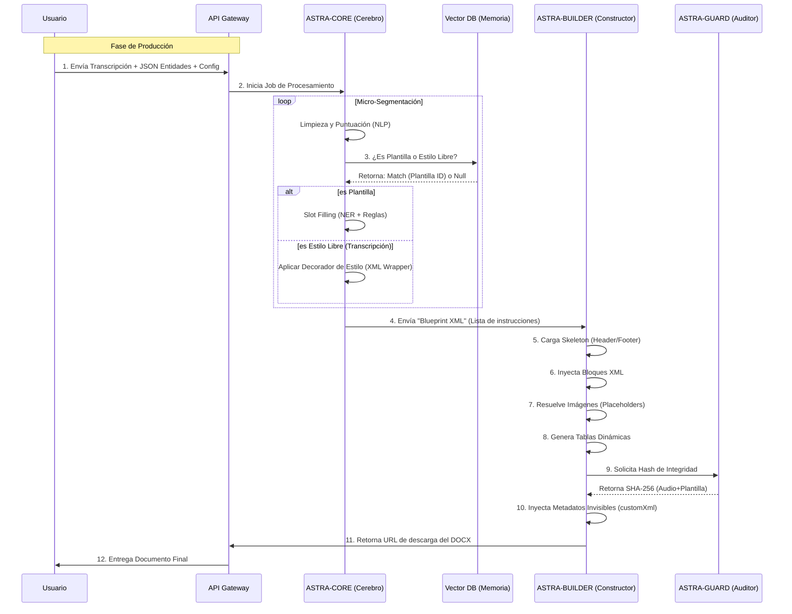

Esta es la culminación de todo nuestro análisis. Vamos a definir la arquitectura de **ASTRA** bajo un enfoque **PRISMA** (Performance, Robustez, Inteligencia, Seguridad, Modularidad, Auditabilidad).

Esta arquitectura no es un script; es una plataforma industrial diseñada para procesar miles de documentos simultáneamente, con trazabilidad legal y separación estricta de inquilinos (Multi-tenant).

---

### 1. El Concepto PRISMA
Para que ASTRA sea "Elite", debe cumplir estos 6 principios:

*   **P**recision: Manipulación directa del XML (OOXML) sin intermediarios.
*   **R**obustez: Arquitectura orientada a eventos (Event-Driven). Si un servicio cae, el mensaje no se pierde.
*   **I**ntelligence: Modelos pequeños y rápidos (ONNX/Quantized) en el borde, no LLMs gigantes.
*   **S**ecurity: Aislamiento total de datos entre Alcaldía A y Concejo B.
*   **M**odularity: Microservicios desacoplados (Ingest, Core, Builder, Guard).
*   **A**uditability: Hashing criptográfico de cada paso.

---

### 2. Diagrama de Arquitectura de Alto Nivel (Cajas Negras)

Este diagrama muestra cómo se organizan los componentes físicos en la nube.

```mermaid
graph TD
    %% CLIENTS
    User[Cliente Web / App] -->|HTTPS/WSS| API[API Gateway & Load Balancer]
    
    %% CONTROL PLANE
    subgraph "Plano de Control (Orquestación)"
        API --> Auth[Auth Service (OAuth2/OIDC)]
        API -->|Eventos| Bus[Event Bus (Kafka / Redpanda)]
    end

    %% DATA PLANE - STORAGE
    subgraph "Capa de Persistencia (Storage)"
        S3[Object Storage (MinIO/S3)]
        VectorDB[Vector DB (Qdrant/Milvus)]
        RelDB[Relational DB (PostgreSQL)]
        AssetStore[Asset Library (Logos/Images)]
    end

    %% COMPUTE PLANE - MICROSERVICES
    subgraph "Capa de Procesamiento (ASTRA Engine)"
        
        %% INGESTION SERVICE
        Ingest[ASTRA-INGEST]
        Bus -->|New DOCX| Ingest
        Ingest -->|Vectors| VectorDB
        Ingest -->|Assets| AssetStore
        Ingest -->|Templates| RelDB

        %% CORE LOGIC
        Core[ASTRA-CORE]
        Bus -->|New Transcript| Core
        Core <-->|Fetch Context| RelDB
        Core <-->|Search Template| VectorDB
        
        %% BUILDER SERVICE
        Builder[ASTRA-BUILDER]
        Core -->|XML Blueprint| Builder
        Builder <-->|Fetch Assets| AssetStore
        Builder -->|Save DOCX| S3

        %% GUARD SERVICE
        Guard[ASTRA-GUARD]
        Builder -->|Request Hash| Guard
        Guard -->|Audit Log| RelDB

        %% LEARNING LOOP
        Learn[ASTRA-LEARN]
        Bus -->|Feedback/Correction| Learn
        Learn -->|Update Weights| Core
    end
```

---

### 3. Diagrama de Flujo de Datos (Pipeline Lógico)

Aquí vemos el viaje del dato, desde que entra el audio/texto hasta que sale el DOCX firmado.



---

### 4. Stack Tecnológico Sugerido (Nivel Elite)

Para soportar esto con alto rendimiento y bajos costos operativos:

#### A. Infraestructura y Orquestación
*   **Orquestador:** **Kubernetes (K8s)**. Esencial para escalar los workers de `CORE` y `BUILDER` independientemente.
*   **Event Bus:** **Redpanda** (compatible con Kafka, pero escrito en C++, 10x más rápido, menos consumo de RAM) o **NATS JetStream** (muy ligero).

#### B. Persistencia
*   **Vector DB:** **Qdrant** (Escrito en Rust, rapidísimo, soporta filtrado por payload para Multi-tenant). *Clave: Filtra vectores por `tenant_id`.*
*   **Relational DB:** **PostgreSQL 16**. Sólido, soporta JSONB para configuraciones flexibles.
*   **Object Storage:** **MinIO** (Self-hosted S3 compatible) o AWS S3 directo.

#### C. Lenguajes de Programación (El enfoque Políglota)
*   **ASTRA-CORE (Python 3.11+):**
    *   Librerías: `Spacy` (NLP rápido), `FastAPI` (API), `Pydantic` (Validación estricta de datos), `Sentence-Transformers` (Embeddings).
    *   *Por qué:* El ecosistema de ML está en Python.
*   **ASTRA-BUILDER (Rust):**
    *   Librerías: `quick-xml` (Parsing XML ultra rápido), `zip` (manejo de archivos).
    *   *Por qué:* Manipular XMLs gigantes y zippear archivos consume mucha CPU/RAM. **Rust** garantiza seguridad de memoria y velocidad extrema. Si prefieres Python, usa `lxml` (C-bindings), pero Rust es el nivel "Elite".

#### D. Modelos de IA (Small Language Models)
*   **Embeddings:** `paraphrase-multilingual-mpnet-base-v2` (Pequeño, muy preciso en español).
*   **Clasificación:** `DistilBERT` fine-tuned o incluso `XGBoost` sobre embeddings (microsegundos de inferencia).
*   **Puntuación:** `DeepMultilingualPunctuation` (basado en BERT, pero optimizado).

---

### 5. Características "Killer" de esta Arquitectura

1.  **Inmutabilidad del Skeleton:** El `ASTRA-BUILDER` no inventa estructura. Carga un archivo XML base (`template.docx` descomprimido) y solo inyecta nodos en puntos de anclaje seguros. Esto evita que el documento se corrompa.
2.  **Activos Desduplicados:** Si 50 alcaldías usan el escudo de Colombia, el archivo de imagen solo se guarda 1 vez en el `AssetStore` con su Hash. Ahorro masivo de almacenamiento.
3.  **Auditoría Forense:** Gracias a `ASTRA-GUARD`, cada documento tiene en sus metadatos internos (`customXml/item1.xml`) un JSON firmado con:
    ```json
    {
      "audio_hash": "a1b2...",
      "transcription_id": "tx_99",
      "template_version": "v2026.01",
      "generation_time": "2026-02-12T10:00:00Z",
      "integrity_hash": "f7c3..."
    }
    ```
    Esto permite a un juez validar el documento digitalmente.

4.  **Recuperación ante Desastres:** Al ser Event-Driven, si el servidor se apaga a mitad de proceso, al reiniciarse, el mensaje sigue en la cola (Kafka/Redpanda) y el trabajo se retoma sin perder datos.

Esta es la arquitectura **ASTRA**. Es sólida, auditable y está diseñada para ser vendida como un SaaS gubernamental de alta gama. ¿Procedemos a detallar algún módulo específico o cerramos el diseño aquí?